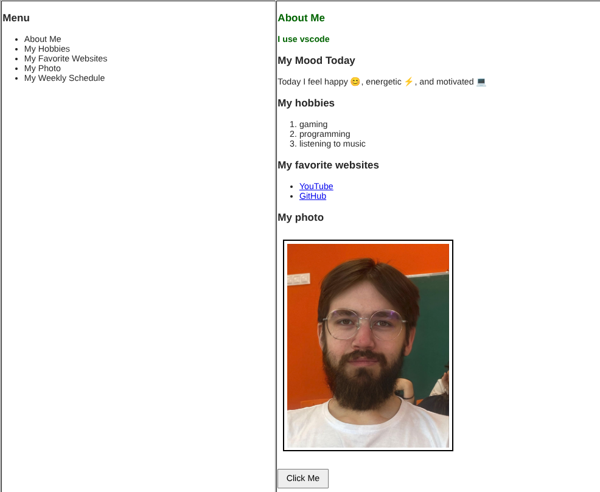
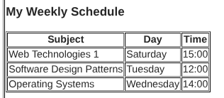
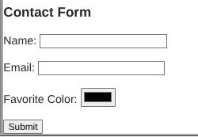
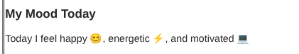
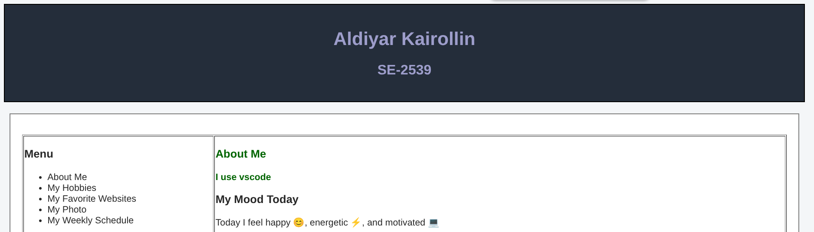
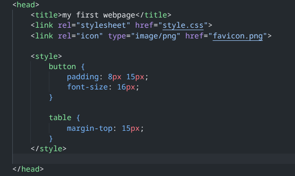
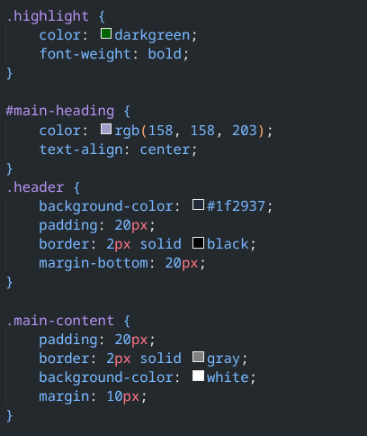
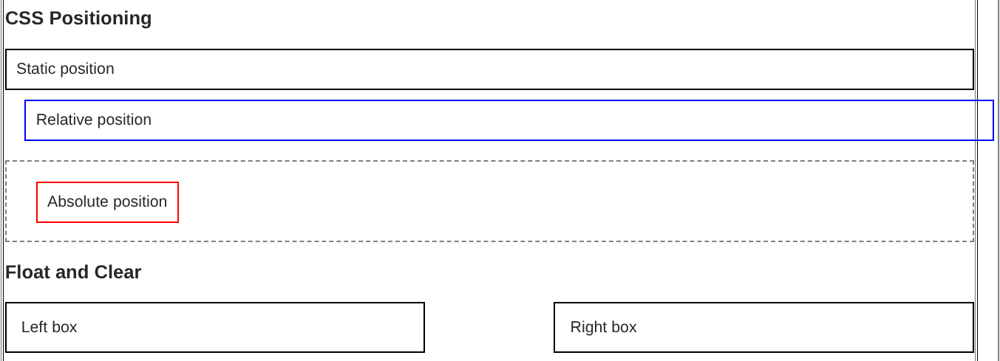
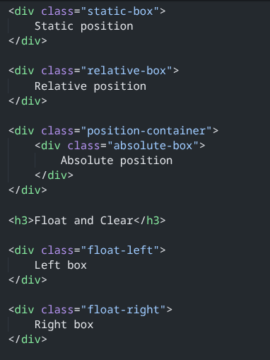
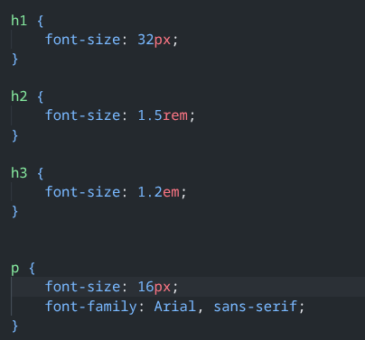

# Assignment 1 - HTML & CSS Basics

**Name:** Aldiyar Kairollin
**Group:** SE-2539
**Course:** Web Technologies 1: Frontend

## Project Files

- `index.html` — main webpage
- `style.css` — external CSS stylesheet
- `photo.png` — personal photo
- `favicon.png` — website favicon
- `screenshots/` — screenshots for each assignment part

---

## Part 1 - Introduction to HTML

**0.** Created the basic HTML structure and set the page title to **My First Webpage**.

**1.** Added headings with my name, group, About Me section, and a short personal paragraph.

**2.** Created an ordered list of my hobbies and an unordered list of my favorite websites.

**3.** Added my photo and clickable links to YouTube and GitHub.

**4.** Added a button with the text **Click Me**.

---

## Part 2 - Intermediate HTML

**5.** Created a weekly class schedule with Subject, Day, and Time columns.

**6.** Created a two-column layout with a menu on the left and main content on the right.

**7.** Added a paragraph describing my mood with three emojis.

**8.** Created a form with Name, Email, Favorite Color, and Submit fields.

  
  
  

---

## Part 3 - Introduction to CSS

**9.** Added CSS styling to the existing HTML page.

**10.** Changed the color of a paragraph using inline CSS.

**11.** Added internal CSS using a `<style>` element inside the `<head>`.

**12.** Created and linked an external `style.css` file.

**13.** Used element, class, and ID selectors in the stylesheet.

**14.** Used the `.highlight` class for multiple elements and the `#main-heading` ID for the main heading.

  
  
  

---

## Part 4 - Intermediate CSS

**15.** Added a custom PNG favicon to the webpage.

**16.** Used `
` elements to organize the page into Header, Main Content, and Footer.

**17.** Applied the box model using borders, margins, and padding.

**18.** Demonstrated static, relative, and absolute positioning.

**19.** Used `px`, `%`, `em`, and `rem` units for sizing.

**20.** Created left and right floating boxes and used `clear: both` to clear them.

**21.** Prepared the project for publication using GitHub Pages.

  
  
  

---

## Summary

This assignment allowed me to practice HTML structure, lists, images, links, tables, forms, and different CSS techniques including selectors, classes, IDs, box model, positioning, sizing, float, and clear.

## Link to website

https://sasas991.github.io/frontend-assignment1/